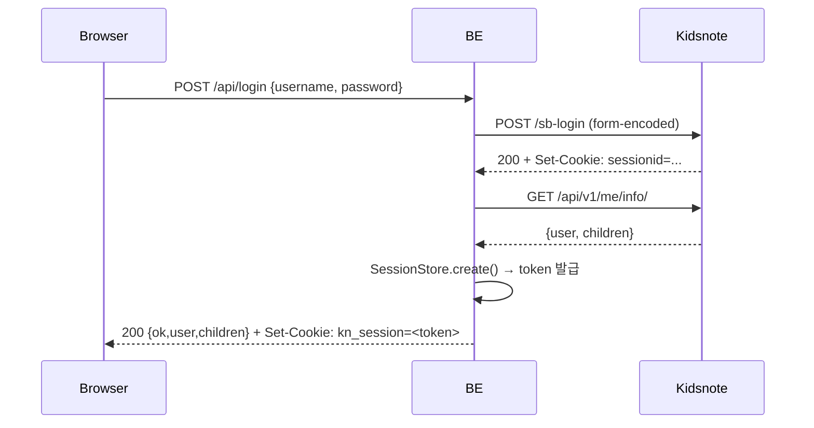
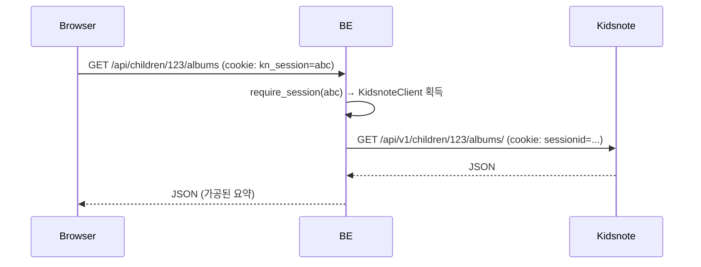

# 04. 인증 플로우

Kidsnote는 Django REST Framework 기반이며, **Bearer 토큰이 아니라 `sessionid` 세션 쿠키**를 사용합니다. 이 문서는 앱이 어떻게 3단(브라우저 → 우리 서버 → Kidsnote) 인증 상태를 관리하는지 설명합니다.

## 3-계층 세션 구조

```
[Browser]                  [kidsnote-app backend]                  [kidsnote.com]

 kn_session   ───────────▶   SessionStore(SQLite)      ───────────▶   sessionid
 (httpOnly,                   token → sessionid                          (requests.Session
  2h TTL, lax)                                                          쿠키 자 안)
```

- **브라우저 쿠키 (`kn_session`)**: 우리 서버가 발행한 랜덤 토큰 (`secrets.token_urlsafe(32)`). 브라우저는 이것만 소지.
- **서버 세션 스토어**: 토큰 → SQLite row (`sessionid`, username, timestamps). 요청 시 `KidsnoteClient` 복원.
- **Kidsnote 세션 (`sessionid`)**: 우리 서버의 `requests.Session` 쿠키 자 안에만 존재. 디스크/DB에 쓰지 않음.

## 로그인 요청 → 응답



## 이후 API 요청



## 만료 / 로그아웃

- 서버 세션 TTL 2시간 (`SessionStore._ttl`). `get()` 호출 시마다 `last_seen_at` 갱신 — **슬라이딩 윈도우**.
- Kidsnote가 401/403 반환 → 해당 세션 즉시 삭제 + 브라우저에 401 전달 → 프론트가 로그인 화면으로 전환.
- `POST /api/logout` → 서버 세션 + 브라우저 쿠키 모두 삭제.

## 보안 포인트

| 위협 | 대응 |
|---|---|
| 자격증명 유출 | 디스크/DB에 쓰지 않음. 서버 재시작 시 전부 휘발. |
| XSS로 쿠키 탈취 | `httpOnly` 플래그로 JS 접근 차단. |
| CSRF | 현재는 `samesite=lax`로 단순 방어. **POST 경로에 CSRF 토큰 미도입** (향후 과제). |
| 세션 고정 | 로그인 시마다 새 토큰 발급. |
| 평문 전송 | 로컬 개발은 HTTP. 배포 시 HTTPS 필수 + `Secure` 플래그 추가 필요. |

## 재시작/다중 프로세스 주의

현재 `SessionStore`는 **SQLite 기반** 입니다.
- `uvicorn --reload` 시 코드 변경으로 프로세스가 재시작되어도 로그인 세션은 복구 가능.
- 다만 다운로드 잡 상태는 여전히 프로세스 메모리이므로, 현 구조는 **단일 프로세스 운영** 기준이 더 안전합니다.

## `sessionid` 복원 기능

`KidsnoteClient.restore_session(sessionid)`가 존재합니다. 외부에서 기존 Kidsnote 세션 쿠키 값을 넣어 클라이언트를 초기화 가능 — 테스트/스크립트용 헬퍼. 현재 웹 API 경로에서는 사용하지 않음.
